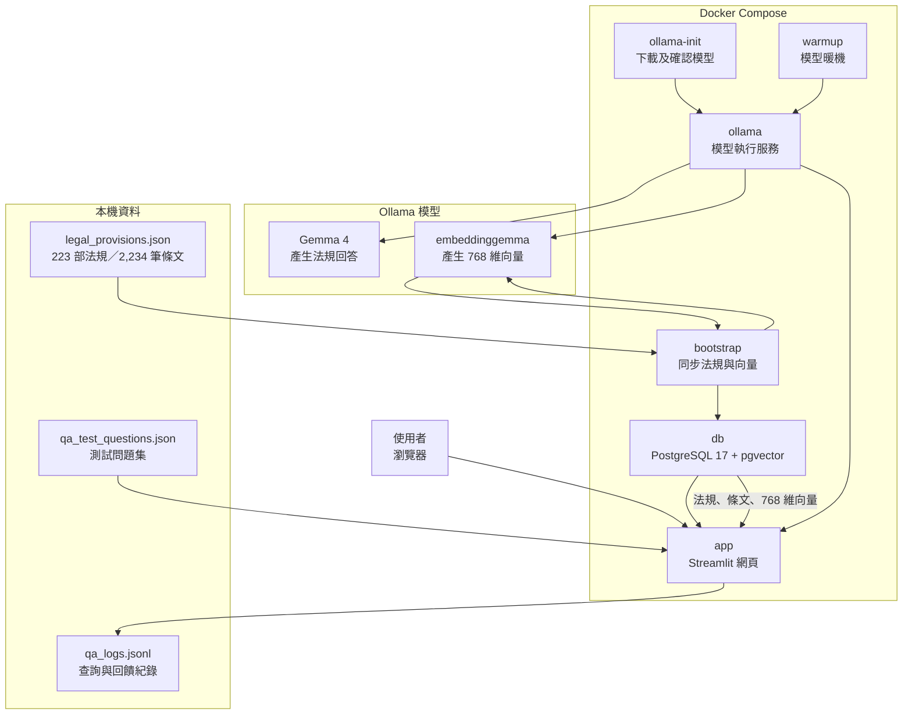
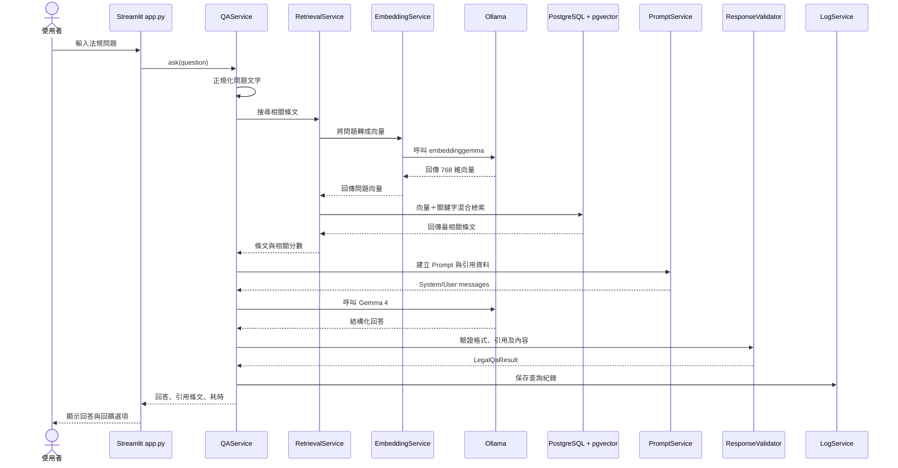

# 法規 AI QA 專案結構與資料流

## 系統結構

```mermaid
flowchart TB
    USER["使用者<br/>瀏覽器"] --> APP

    subgraph COMPOSE["Docker Compose"]
        DB["db<br/>PostgreSQL 17 + pgvector"]
        OLLAMA["ollama<br/>模型執行服務"]
        INIT["ollama-init<br/>下載及確認模型"]
        WARM["warmup<br/>模型暖機"]
        BOOT["bootstrap<br/>同步法規與向量"]
        APP["app<br/>Streamlit 網頁"]
    end

    subgraph MODELS["Ollama 模型"]
        CHAT["Gemma 4<br/>產生法規回答"]
        EMBED["embeddinggemma<br/>產生 768 維向量"]
    end

    subgraph DATA["本機資料"]
        LAWS["legal_provisions.json<br/>223 部法規／2,234 筆條文"]
        QUESTIONS["qa_test_questions.json<br/>測試問題集"]
        LOGS["qa_logs.jsonl<br/>查詢與回饋紀錄"]
    end

    INIT --> OLLAMA
    WARM --> OLLAMA
    OLLAMA --> CHAT
    OLLAMA --> EMBED

    LAWS --> BOOT
    BOOT --> EMBED
    EMBED --> BOOT
    BOOT --> DB

    DB --> APP
    OLLAMA --> APP
    QUESTIONS --> APP
    APP --> LOGS

    DB -->|"法規、條文、768 維向量"| APP
```

## 每次查詢的資料流

```mermaid
sequenceDiagram
    actor U as 使用者
    participant UI as Streamlit app.py
    participant QA as QAService
    participant R as RetrievalService
    participant E as EmbeddingService
    participant O as Ollama
    participant DB as PostgreSQL + pgvector
    participant P as PromptService
    participant V as ResponseValidator
    participant L as LogService

    U->>UI: 輸入法規問題
    UI->>QA: ask(question)
    QA->>QA: 正規化問題文字

    QA->>R: 搜尋相關條文
    R->>E: 將問題轉成向量
    E->>O: 呼叫 embeddinggemma
    O-->>E: 回傳 768 維向量
    E-->>R: 回傳問題向量

    R->>DB: 向量＋關鍵字混合檢索
    DB-->>R: 回傳最相關條文
    R-->>QA: 條文與相關分數

    QA->>P: 建立 Prompt 與引用資料
    P-->>QA: System/User messages

    QA->>O: 呼叫 Gemma 4
    O-->>QA: 結構化回答

    QA->>V: 驗證格式、引用及內容
    V-->>QA: LegalQaResult

    QA->>L: 保存查詢紀錄
    QA-->>UI: 回答、引用條文、耗時
    UI-->>U: 顯示回答與回饋選項
```
